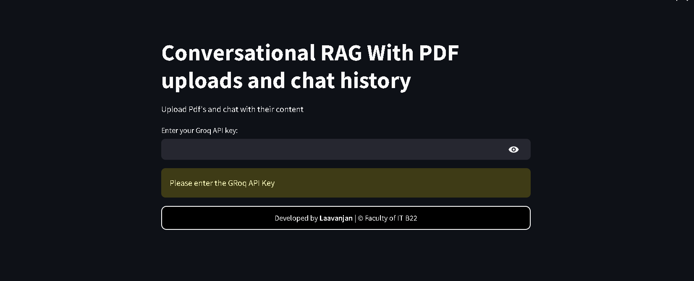
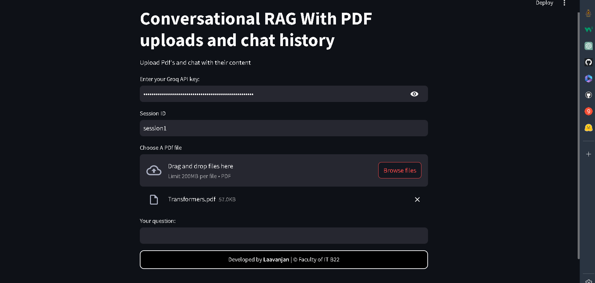
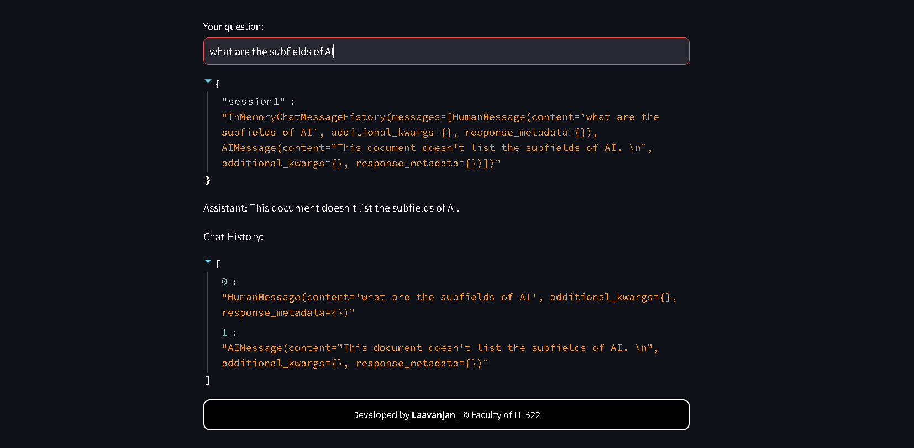
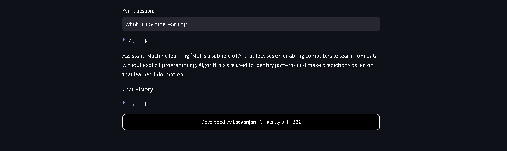
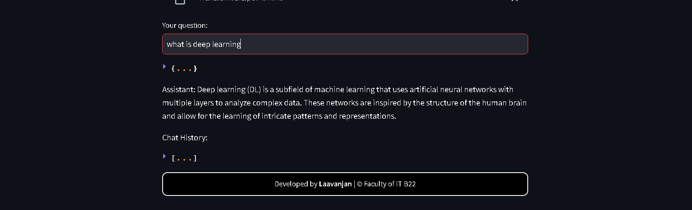
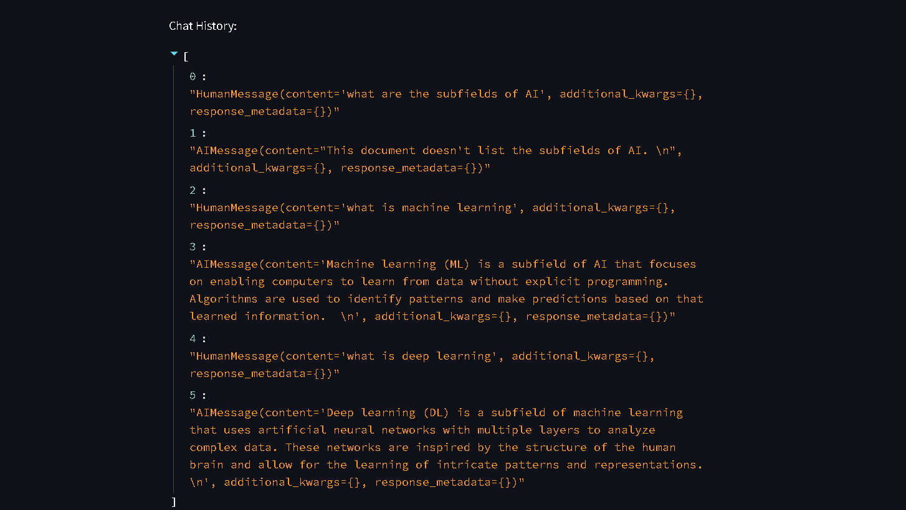

# Conversational-RAG-With-PDF-uploads-and-chat-history

This repository demonstrates a conversational Retrieval Augmented Generation (RAG) application that allows users to upload PDF files and engage in interactive conversations with the content of those PDFs.  The application leverages LangChain, ChromaDB, Hugging Face embeddings, and the Groq LLM to provide a seamless and context-aware chat experience.
📸 Example Usage
| Image 1 | Image 2 | Image 3 |
|---------|---------|---------|
|  |  |  |
| Image 4 | Image 5 | Image 6 |
|  |  |  |


## Table of Contents

- [Introduction](#introduction)
- [Features](#features)
- [Installation](#installation)
- [Usage](#usage)
- [Dependencies](#dependencies)
- [Environment Variables](#environment-variables)
- [Project Structure](#project-structure)
- [Contributing](#contributing)
- [License](#license)
- [Acknowledgements](#acknowledgements)

## Introduction

This project combines the power of vector databases, large language models, and chat history management to create an interactive PDF chatbot. Users can upload multiple PDFs, and the application will process them, create embeddings, and store them in a vector database.  This enables efficient retrieval of relevant information when users ask questions about the PDF content.  The conversational aspect is handled by LangChain's history-aware retriever, allowing the chatbot to maintain context throughout the conversation.

## Features

- **PDF Upload:** Upload multiple PDF files for processing.
- **Contextual Chat:** Engage in conversations with the uploaded PDF content, with the chatbot maintaining context from previous interactions.
- **Efficient Retrieval:** Utilizes ChromaDB for fast and accurate retrieval of relevant information from the PDFs.
- **Hugging Face Embeddings:** Employs high-quality sentence embeddings for semantic understanding.
- **Groq LLM Integration:** Leverages the Groq LLM for generating human-like responses.
- **Chat History Management:** Stores and retrieves chat history for each session, enabling context-aware conversations.
- **Streamlit Interface:** Provides a user-friendly interface for uploading files and interacting with the chatbot.

## Installation

1. **Clone the repository:**

   ```bash
   git clone [https://github.com/laavanjan/Conversational-RAG-With-PDF-uploads-and-chat-history.git](https://www.google.com/search?q=https://github.com/laavanjan/Conversational-RAG-With-PDF-uploads-and-chat-history.git)
   cd Conversational-RAG-With-PDF-uploads-and-chat-history
  ``

2.  **Create a virtual environment (recommended):**

    ```bash
    python3 -m venv .venv  # Or python -m venv .venv on Windows
    source .venv/bin/activate  # Or .venv\Scripts\activate on Windows
    ```

3.  **Install the required packages:**

    ```bash
    pip install -r requirements.txt
    ```

## Usage

1.  **Set up environment variables:** See the [Environment Variables](https://www.google.com/url?sa=E&source=gmail&q=#environment-variables) section for details.

2.  **Run the Streamlit application:**

    ```bash
    streamlit run app.py
    ```

3.  **Open the application in your browser:** Streamlit will provide a URL (usually `http://localhost:8501`).

4.  **Upload PDFs:** Use the file uploader to select and upload your PDF files.

5.  **Enter Groq API Key:** Enter your Groq API key in the provided field.

6.  **Start chatting:** Type your questions in the text input field and press Enter.

## Dependencies

  - streamlit
  - langchain
  - chromadb
  - langchain-community
  - langchain-core
  - langchain-groq
  - langchain-huggingface
  - langchain-text-splitters
  - langchain-community
  - python-dotenv

You can install these dependencies using `pip install -r requirements.txt`.  A `requirements.txt` file should be included in your repository.  If not, create one with the listed dependencies.

## Environment Variables

Create a `.env` file in the root directory of the project and add the following environment variables:

```
HF_TOKEN=<YOUR_HUGGING_FACE_TOKEN>
```

You will also need to enter your Groq API key in the Streamlit application itself.

## Project Structure

```
Conversational-RAG-With-PDF-uploads-and-chat-history/
├── app.py          # Main Streamlit application
├── .env            # Environment variables file
├── requirements.txt # Project dependencies
├── chroma_db/      # ChromaDB persistent directory (will be created)
└── ...             # Other files
```

## Contributing

Contributions are welcome\! Please open an issue or submit a pull request.

## License

This project is licensed under the GPL License - see the [LICENSE](LICENSE) file for details.  *(Create a LICENSE file in your repository)*

## Acknowledgements

This project utilizes the following open-source libraries and services:

  - LangChain: [https://python.langchain.com/en/latest/index.html](https://www.google.com/url?sa=E&source=gmail&q=https://python.langchain.com/en/latest/index.html)
  - ChromaDB: [https://www.trychroma.com/](https://www.google.com/url?sa=E&source=gmail&q=https://www.trychroma.com/)
  - Hugging Face: [https://huggingface.co/](https://www.google.com/url?sa=E&source=gmail&q=https://huggingface.co/)
  - Groq: [https://groq.com/](https://www.google.com/url?sa=E&source=gmail&q=https://groq.com/)
  - Streamlit: [https://streamlit.io/](https://www.google.com/url?sa=E&source=gmail&q=https://streamlit.io/)


